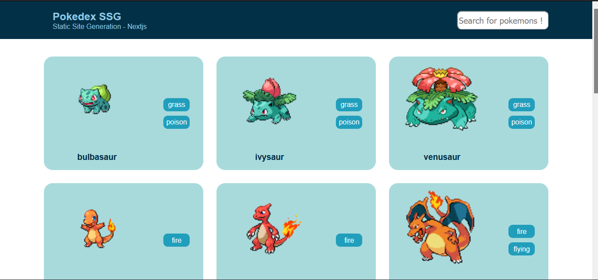
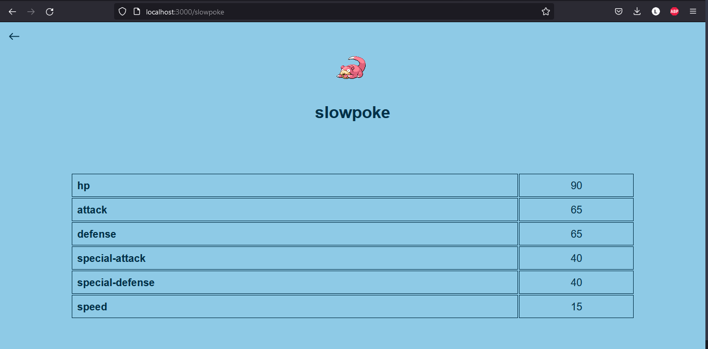

# Welcome to the Pokedex-ssg

## This project was created using Static Site Generation with Nextjs.

## Commands:

```bash
# install node_modules:
yarn

# run the project:
yarn dev
# Open http://localhost:3000 with your browser to see the result.
```

# Images of the pokedex-ssg

## Home page



## Dynamic Pokemon Page


